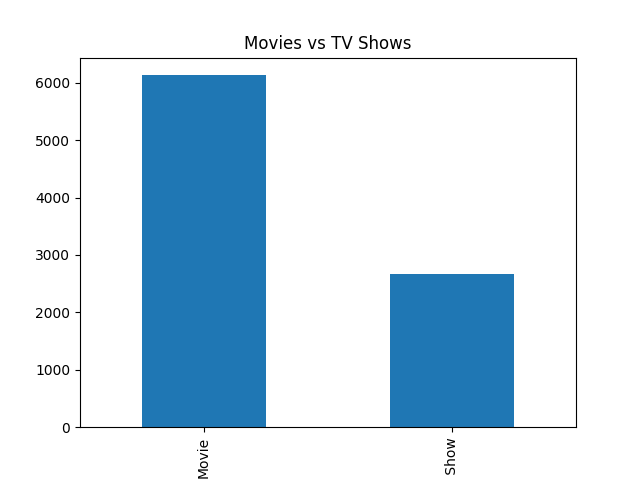
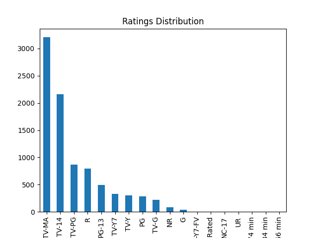
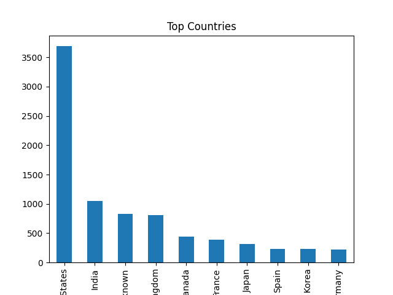
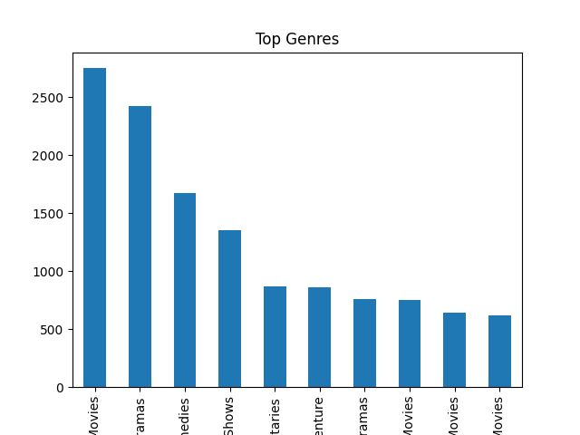
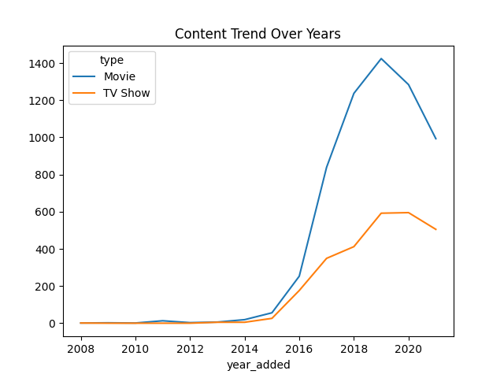

# 🎬 Netflix Data Analysis Project

## 📌 Overview
This project is an Exploratory Data Analysis (EDA) of the Netflix dataset.  
The goal is to understand content trends, categories, and patterns using Python.

---

## 📂 Dataset
- Source: Kaggle Netflix Dataset  
- Contains movies and TV shows available on Netflix  
- Includes: title, director, cast, country, rating, release year, etc.

---

## 🛠️ Tools Used
- Python 🐍  
- Pandas  
- NumPy  
- Matplotlib  

---

# 📊 Key Insights & Visualizations

---

## 🎬 1. Movies vs TV Shows

Netflix has more Movies compared to TV Shows.

---

## ⭐ 2. Ratings Distribution

Most content is targeted toward mature audiences (TV-MA, TV-14).

---

## 🌍 3. Top Countries Producing Content

United States and India are leading content producers.

---

## 🎭 4. Top Genres

Dramas and International Movies dominate Netflix content.

---

## 📈 5. Content Trend Over Years

Netflix content has increased significantly after 2015.

---

# 🧹 Data Cleaning Performed
- Handled missing values using fillna()
- Converted date column to datetime format
- Extracted year and month from date
- Removed duplicates

---

# 📌 Key Insights
- Netflix focuses heavily on movies
- Mature-rated content dominates platform
- Content production is increasing yearly
- USA leads in content contribution
- Global content (international movies) is growing

---

# 🚀 Skills Learned
- Data Cleaning
- Exploratory Data Analysis (EDA)
- Data Visualization
- Pandas & NumPy
- Real-world dataset handling

---

# 📁 Project Structure

Netflix-Data-Analysis/
│
├── data/
├── notebooks/
├── images/
├── README.md
└── requirements.txt

---

# 📌 Conclusion
This project helped in understanding real-world data analysis workflow and extracting meaningful insights from raw data.

---

# 🙌 Author
   NAGARAJ P